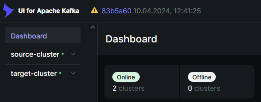

# KRAFT6
## Финальный проект (Разработать аналитическую платформу для маркетплейса)

## Архитектура решения представлена следующими сервисами:
### 1. kafka-ui
### 2. schema-registrar
### 3. schema-registry - правляемый репозиторий схем
### 4. zookeeper
### 5. kafka-0
### 6. kafka-1
### 7. kafka-2
### 8. kafka-init
### 9. target-zookeeper
### 10. target-kafka-0
### 11. target-kafka-1
### 12. target-kafka-2
### 13. target-kafka-init
### 14. mirror-maker

### 15. shopapi
Веб-сервис который отправляет данные о товарах в кафку.
Swagger - http://localhost:8085/docs

### 16. clientapi
Веб-сервис который моделирует запросы от клиентов.
Swagger - http://localhost:8086/docs

### 17. elasticsearch
Сервис для хранения и анализа данных.

### 18. kibana
Сервис, который предоставляет интерфейс для визуализации и анализа данных.

### 19. hadoop-namenode

### 20. hadoop-datanode-1

### 21. hadoop-datanode-2

### 22. hadoop-datanode-3

### 23. hadoopapi
Веб-сервис который моделирует перенос данных в HDFS, а так же отправление рекомендаций в топик Kafka.
Swagger - http://localhost:8087/docs

### Шаг 1. Создайте источники данных
ok

### Шаг 2. Разверните Apache Kafka и настройте топики
ok

### Шаг 3. Разработайте аналитическую систему
ok

### Шаг 4. Реализуйте потоковую обработку данных

### Шаг 5. Настройте базу данных

### Шаг 6. Настройте мониторинг Kafka

### Шаг 7. Оформите документацию


## Пример использования

### 1. Поднять контейнеры

```bash
docker compose up -d
```

### 2. Перейти в UI Kafka

```bash
http://localhost:8080/
```
Убедиться что поднято 2 кластера:

