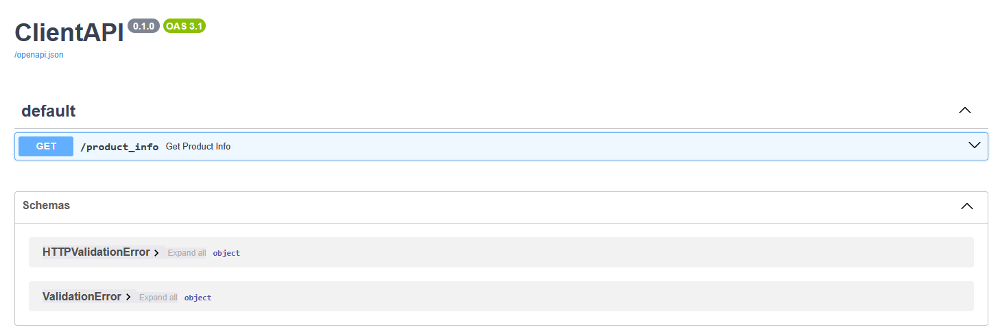

# KRAFT6
## Финальный проект (Разработать аналитическую платформу для маркетплейса)

## Архитектура решения представлена следующими сервисами:
### 1. kafka-ui
### 2. schema-registrar
### 3. schema-registry - правляемый репозиторий схем
### 4. zookeeper
### 5. kafka-0
### 6. kafka-1
### 7. kafka-2
### 8. kafka-init
### 9. target-zookeeper
### 10. target-kafka-0
### 11. target-kafka-1
### 12. target-kafka-2
### 13. target-kafka-init
### 14. mirror-maker

### 15. shopapi
Веб-сервис который отправляет данные о товарах в кафку.
Swagger - http://localhost:8085/docs

### 16. clientapi
Веб-сервис который моделирует запросы от клиентов.
Swagger - http://localhost:8086/docs

### 17. elasticsearch
Сервис для хранения и анализа данных.

### 18. kibana
Сервис, который предоставляет интерфейс для визуализации и анализа данных.

### 19. hadoop-namenode

### 20. hadoop-datanode-1

### 21. hadoop-datanode-2

### 22. hadoop-datanode-3

### 23. hadoopapi
Веб-сервис который моделирует перенос данных в HDFS, а так же отправление рекомендаций в топик Kafka.
Swagger - http://localhost:8087/docs

### 24. streamprocessing
Сервис потоковой обработки данных.

### 25. kafka-connect
Сервис для сохранения данных из топика в файл.

### 26. kafka-connect-init
Сервис для регистрации коннектора.

### 27. prometheus
Сервис для сбора метрик.

### 28. grafana
Сервис для визуализации собранных метрик.

### 29. alertmanager
Сервис для отправки уведомлений.

## Пример использования

### 1. Поднять контейнеры

```bash
docker compose up -d
```

### 2. Перейти в UI Kafka

```bash
http://localhost:8080/
```

Убедиться что поднято 2 кластера:


Проверить более детально поднятый основной кластер:

Брокеры,


Топики,


Консьюмеры,


Схемы,


ACL,


Так же, проверить дублирующий кластер:

Брокеры,


Топики (пока нет копий из основного кластера),


Консьюмеры (так же пока ничего нет),


Схемы,


ACL,


### 3. Смоделировать отправку данных о товарах

Перейти в сервис shopapi

```bash
http://localhost:8085/docs
```


и выполнить запрос set_products

В результате на основном кластере в топике products появиться 5 продуктов:


Так же данный топик будет создан на дублирующем кластере (данные будут загружены и туда при помощи сервиса mirror-maker).

### 4. Смоделировать поиск информации о товаре

Перейти в сервис clientapi

```bash
http://localhost:8086/docs
```



и выполнить запрос get_product_info, указав например, клавиатура


В результате данный запрос попадет в топик search-products на основном:


и дублирующем кластере:


Так же, данный запрос попадет еще и в сервис elasticsearch.
Перейти в сервис kibana

```bash
http://localhost:5601/app/management/kibana/
```

Создать index pattern


Далее перейти в Discover, где можно увидеть поисковой запрос:


### 5. Смоделировать отправку данных в HDFS

Перейти в сервис hadoopapi


и выполнить запросы get_data (данные попадут в HDFS)


и get_recommendations,


рекомендации попадут в топик recommendations на дублирующем кластере:


### 6. Смоделировать потоковую обработку данных

Перейти в сервис streamprocessing (провалиться в логи контейнера)


Видим что прогрузилось 5 товаров.
Далее смоделировать блокировку товаров.

Перейти в сервис shopapi, 

```bash
http://localhost:8085/docs
```

и выполнить запрос set_ban_products (указав например, 1, 2, 3, 4 - последовательно)

В результате данные попадут в топик ban-products на основном кластере:


Выполнить повторную загрузку товаров (в этом же сервисе, set_products)

В результате, в сервисе streamprocessing можно увидеть, во первых обработку заблокированных товаров, 
во вторых что был обработан только товар с идентфикатором 5 (который не был заблокирован)


### 7. Смоделировать запись в файл

Если выполнить запрос (подставив идентификатор сервиса kafka-connect)

```bash
docker exec 17fa932644ef750ec49246504e65d1ddae28eebb2c1ce3f61387f3aa5174e564 cat /home/appuser/products.out
```

можно увидеть следующее:


Это говорит о том что сервис kafka-connect пишет данные из топика products в файл.

### 8. Мониторинг

Перейти в сервис prometheus:

```bash
http://localhost:9060/targets
```

Видим что сервис собирает метрики с двух кластеров:


Перейти в сервис grafana:

```bash
http://localhost:3000/dashboards
```

Выбрать дашборд Kafka Broker Metrics:


Так же был поднять сервис alertmanager (настроено оповещение)
Для корректной работы сервиса необходимо указать почту отправителя и пароль, а так же почту получателя.


Смоделировать падение брокера, остановить например kafka-0:


